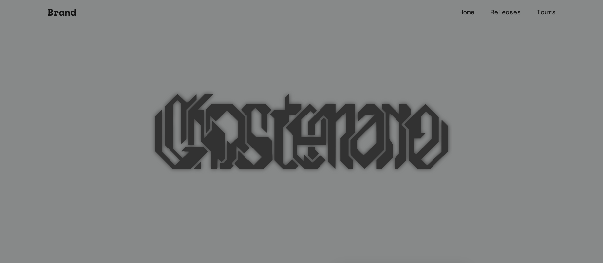

# GHOSTEMANE.com


<div align = 'center'>
  
   
  
  
  
</div>

## Начало работы

1. Клонирование репозитория 

```git clone https://github.com/hydrovskiy/ghostemane.com.git```

2. Переход в директорию ghostemane.com

```cd ghostemane.com```

3. Устанавливаем зависимости

```npm i```

## Основные команды

```yarn start``` - запустить на вашем сервере

```yarn dev``` - запуск dev-сервера

```yarn build``` - build проекта

## Как развернуть сайт?

1. Заходим на сайт [Vercel](https://vercel.com) и авторизируемся через ваш Github!
2. Импортируем этот репозиторий с вашего Github.
3. По желанию добавляем домен.
4. Готово! Теперь сайт работает и размещен на вашем домене.
